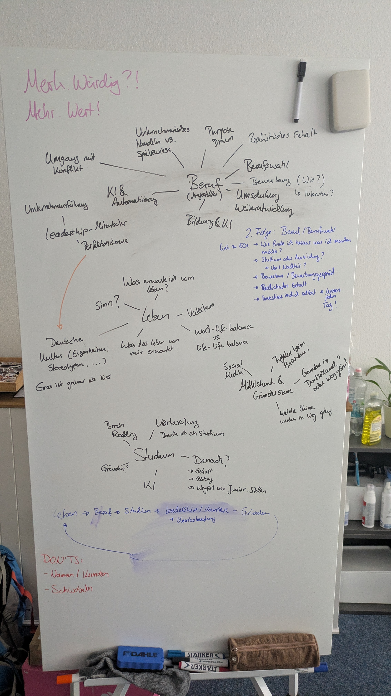

# Episode 01 von Merk.Würdig?! - Intro

In der ersten Folge des Podcasts "Merk.Würdig?!" stellen wir uns und den Podcast vor.
Wir erzählen wie wir zu der Entscheidung gekommen sind einen Podcast zu starten und wie wir den Namen "Merk.Würdig?!" gefunden haben.

Wir haben eine kleine Roadmap an Themen vorbereitet über die wir in den nächsten Folgen sprechen werden.

* Beruf und Berufseinstieg
* Studium und Ausbildung
* Leadership und Persönlichkeitsentwicklung
* Gründerszene und Unternehmertum

Einen Überblick über die geplanten Inhalte sind in folgendem Bild dargestellt:

